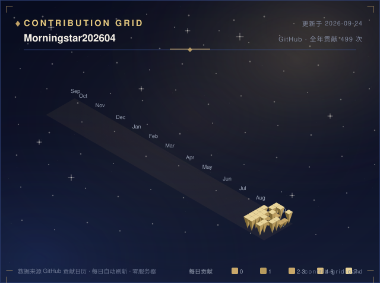
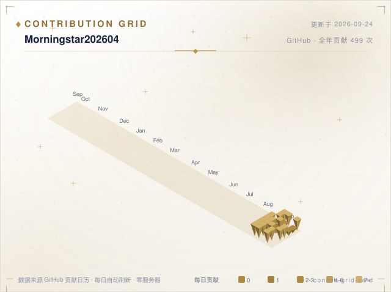

<p align="center">
  
</p>

<h1 align="center">Contrib Grid Card</h1>

<p align="center">
  <b>The 3D golden contribution grid for your GitHub profile.</b><br/>
  The "obviously different" card — isometric golden columns, real data, dark &amp; light themes, zero server.
</p>

<p align="center">
  <a href="https://github.com/Morningstar202604/contrib-grid-card/stargazers"></a>
  <a href="https://github.com/Morningstar202604/contrib-grid-card/forks"></a>
  <a href="LICENSE"></a>
  <a href="https://github.com/Morningstar202604/profile-verse"></a>
</p>

A whole year of contributions as **isometric golden 3D columns** — light top, mid side, dark side — in five gold tiers over 53 weeks. No flat heatmap squares, no snake, no clone wars. Real data from the GitHub contribution calendar, stamped with source and refresh time.

This repo is the standalone release of the `contrib-grid-card` component from [Profile Verse](https://github.com/Morningstar202604/profile-verse). Use it standalone, or grab the whole 9-card family.

> 🚀 **Live**: [Morningstar202604's homepage](https://github.com/Morningstar202604/Morningstar202604) runs this card daily.

## Dark & light



## Usage

Add a workflow step to your profile repo (`.github/workflows/contrib-grid.yml`):

```yaml
name: Contrib Grid

on:
  schedule:
    - cron: "10 1 * * *"
  workflow_dispatch:

permissions:
  contents: write

jobs:
  card:
    runs-on: ubuntu-latest
    steps:
      - uses: actions/checkout@v4
      - uses: Morningstar202604/contrib-grid-card@v1
        with:
          user: your-github-username
          output: contrib-grid-card.svg
          theme: dark          # dark | light | rose | ocean

      - name: Commit & push
        run: |
          git config user.name "github-actions[bot]"
          git config user.email "github-actions[bot]@users.noreply.github.com"
          git add contrib-grid-card.svg
          if ! git diff --cached --quiet; then
            git commit -m "chore: refresh contrib grid [skip ci]"
            git push
          fi
```

Then reference it in your README with the theme-switching `<picture>` trick:

```markdown
<picture>
  <source media="(prefers-color-scheme: dark)" srcset="./contrib-grid-card.svg">
  
</picture>
```

## Inputs

| Input | Default | Description |
| --- | --- | --- |
| `user` | — | GitHub username (required) |
| `output` | `contrib-grid-card.svg` | Output SVG path |
| `theme` | `dark` | `dark` (Midnight) · `light` (Ivory) · `rose` (Rose Gold) · `ocean` (Deep Sea) |

## Design

- 3D isometric golden columns: top face light / right face mid / left face dark
- Five gold tiers (GitHub levels) with a month axis over 53 weeks
- Postcard letterpress edges: hairline marquees + vertical monograms
- Part of the Profile Verse design language: starry night × gilded gold

## License

MIT © Morningstar202604
